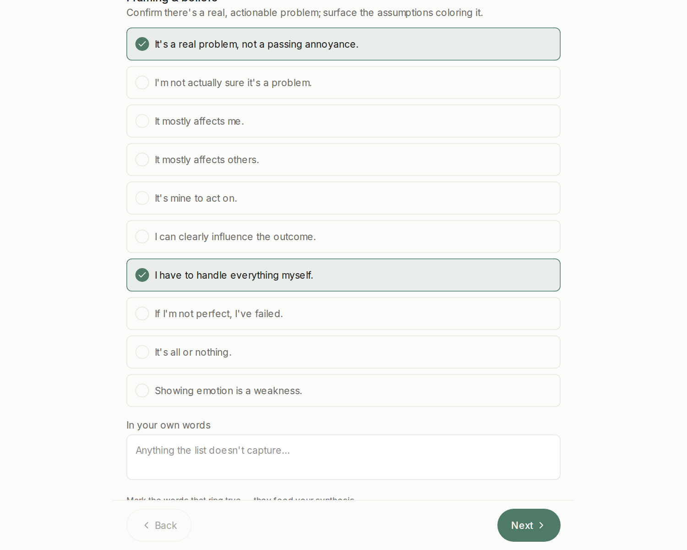
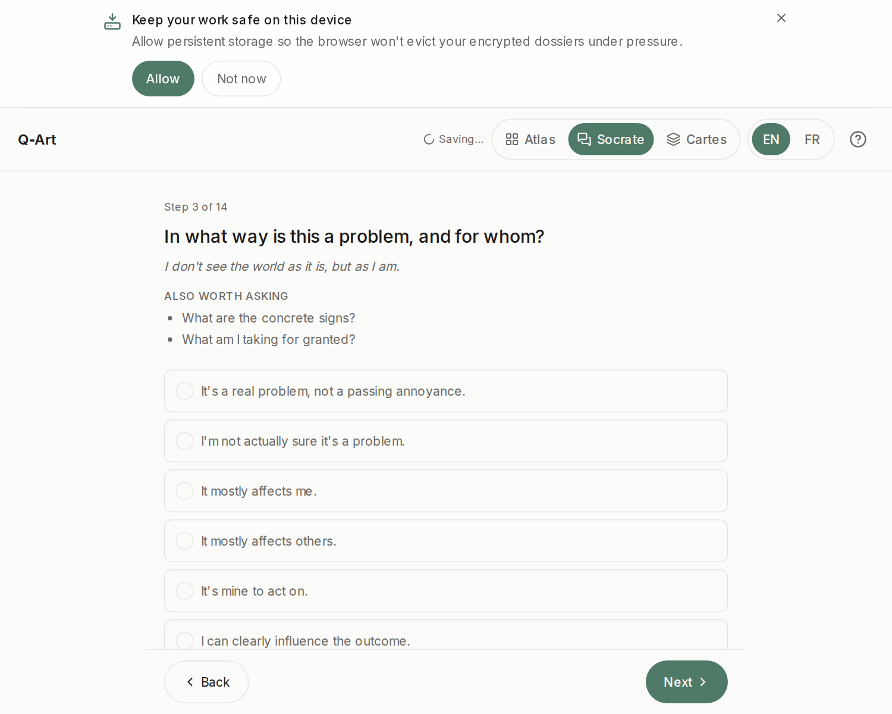
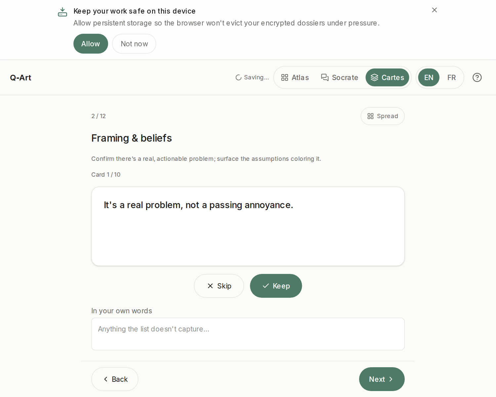

# Choosing your way in — Atlas, Socrate or Cartes

> Part of the [Q‑Art User Guide](./README.md).

Three interfaces, **one method, one decision object**. Whichever you pick, you fill the same map — and you can switch mid-session from the header (*Switch view*) without losing a word. The landing page remembers your last choice.

## Atlas — the workbench

Seven structured boards, all visible, walkable in any order (←/→ keys work; `Ctrl+K`/`⌘K` opens a board overview you can jump from). Dense, deliberate, keyboard-first.

**Pick Atlas when…** you want to see the system whole, you like working at your own pace, or the decision is professional and you want the audit-friendly, everything-on-the-table view.

## Socrate — the dialogue

One question at a time, large type, a gentle pace. Each facet arrives with its guiding question, the *"also worth asking"* follow-ups, and a motto that sets its spirit. In v1 Socrate is fully deterministic — a pre-authored question path, no AI, nothing leaves your device.

**Pick Socrate when…** the decision is emotionally charged, you'd rather be led than choose where to look, or you're on your phone.

## Cartes — the deck

Every proposition becomes a card: **keep** it or **skip** it, one at a time, with a *spread* overview to jump around. Tactile and quick — decisions about each card, not about where to start.

**Pick Cartes when…** you feel blocked in front of forms, you want the lowest-effort way to begin, or you're exploring a question you can't yet articulate.

## Can't decide?

Start with **Cartes** for five minutes. If you catch yourself wanting the whole picture, switch to **Atlas**; if you want more hand-holding, switch to **Socrate**. Nothing is lost in the move — that's the point of one shared map.
