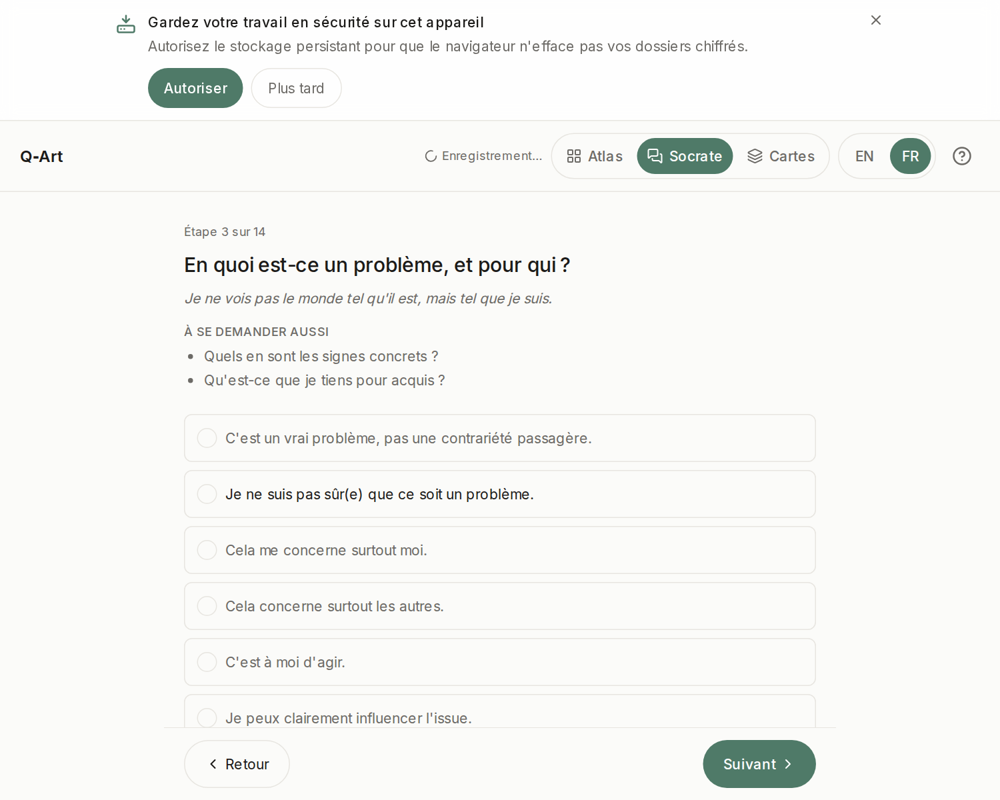

# Choisir votre entrée — Atlas, Socrate ou Cartes

> Fait partie du [guide d'utilisation](./README.md).

Trois interfaces, **une méthode, un seul objet de décision**. Quelle que soit l'entrée, vous remplissez la même carte — et vous pouvez changer en cours de route depuis l'en-tête (*Changer de vue*) sans perdre un mot. L'accueil retient votre dernier choix.

## Atlas — l'établi

Sept tableaux structurés, tous visibles, parcourables dans l'ordre qu'on veut (les flèches ←/→ fonctionnent ; `Ctrl+K`/`⌘K` ouvre une vue d'ensemble pour sauter d'un tableau à l'autre). Dense, posé, clavier d'abord.

**Choisissez Atlas quand…** vous voulez voir le système en entier, avancer à votre rythme, ou que la décision est professionnelle et que vous voulez tout sur la table.

## Socrate — le dialogue

Une question à la fois, de grands caractères, un rythme respirant. Chaque facette arrive avec sa question directrice, ses relances (*« à se demander aussi »*) et une maxime qui donne l'esprit. En v1, Socrate est entièrement déterministe — un cheminement pré-écrit, sans IA, rien ne quitte votre appareil.

**Choisissez Socrate quand…** la décision est chargée émotionnellement, que vous préférez être guidé·e, ou que vous êtes sur téléphone.

## Cartes — le jeu

Chaque proposition devient une carte : on la **garde** ou on la **passe**, une à la fois, avec une *vue d'ensemble* pour naviguer. Tactile et rapide — des décisions sur chaque carte, pas sur « par où commencer ».

**Choisissez Cartes quand…** les formulaires vous bloquent, que vous voulez l'entrée la moins coûteuse, ou que vous explorez une question encore difficile à formuler.

## Vous hésitez ?

Commencez par **Cartes** cinq minutes. Si vous vous surprenez à vouloir la vue d'ensemble, passez à **Atlas** ; si vous voulez plus d'accompagnement, passez à **Socrate**. Rien ne se perd en route — c'est tout l'intérêt d'une carte partagée.
