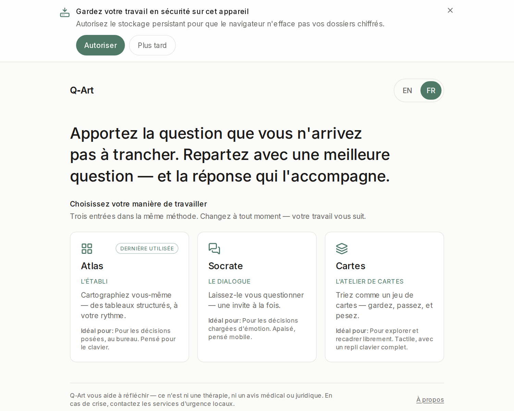

# Démarrer — vos dix premières minutes

> Fait partie du [guide d'utilisation](./README.md).

## 1. Ouvrez Q‑Art

Si quelqu'un a installé Q‑Art pour vous, ouvrez l'adresse qu'on vous a donnée (souvent `http://localhost:3000`). Pour l'installer vous-même sur Debian/Ubuntu, une commande :

```bash
curl -fsSL https://raw.githubusercontent.com/ideotion/q-art/main/install.sh | bash
```

puis ouvrez `http://localhost:3000`. (Options, désinstallation, ce que fait le script : [`docs/install.md`](../../install.md).)

Q‑Art tourne entièrement sur votre machine. Une fois chargé, il fonctionne aussi hors ligne.

## 2. Apportez une vraie question

Q‑Art est fait pour la décision autour de laquelle vous tournez — celle qui n'a pas de bonne réponse évidente :

- *« Devrais-je quitter ce poste ? »*
- *« Devrais-je lâcher mon client le plus exigeant ? »*
- *« Comment gérer la relation avec mon associé ? »*

Formulez-la comme une question, avec vos mots. Si plusieurs s'emmêlent, prenez celle qui pèse le plus **aujourd'hui** — les autres remonteront d'elles-mêmes.

## 3. Choisissez une entrée



Trois portes, une méthode — et toutes écrivent la **même** décision : changez d'interface à tout moment sans perdre un mot.

- **Atlas** — des tableaux structurés, à votre rythme. Pour voir la carte entière.
- **Socrate** — une question apaisée à la fois. Pour les décisions chargées émotionnellement.
- **Cartes** — un jeu de cartes à garder ou passer. Quand on ne sait pas par où commencer.

(Les différences en détail : [Choisir votre entrée](./choisir-une-entree.md).)

## 4. Cochez ce qui sonne juste

Chaque facette de votre question propose une courte liste d'énoncés tout prêts. **Cocher suffit** — pas de note à donner, pas de formulaire à remplir. Deux ou trois coches honnêtes par facette dessinent déjà une carte. Ce que la liste ne capture pas va dans *« Avec vos mots »*, et vous pouvez **retenir** un mot qui compte pour qu'il nourrisse votre synthèse.

Ne visez pas l'exhaustif. Visez l'honnête.

## 5. Lisez votre synthèse

À la fin, Q‑Art **relit votre carte** : ce qui revient sans cesse, ce qui tire contre quoi, le postulat à tester, le bénéfice caché du statu quo. Puis il vous offre **une meilleure question** — et c'est tout l'enjeu :

> Vous ne repartez pas avec un verdict. Vous repartez avec une question reformulée — et la réponse vit le plus souvent dedans.

Quand une reformulation sonne juste, prenez le pivot : **« Explorer cette question — nouveau cycle »**. La carte repart à neuf, la question vous suit, et c'est au second passage que votre **plan d'action** prend forme.

Votre travail s'enregistre tout seul, chiffré, sur cet appareil. Fermez l'onglet quand vous voulez — l'accueil vous proposera de reprendre où vous en étiez.

**La suite :** toute la méthode sur un exemple — [le parcours complet](./parcours.md).
