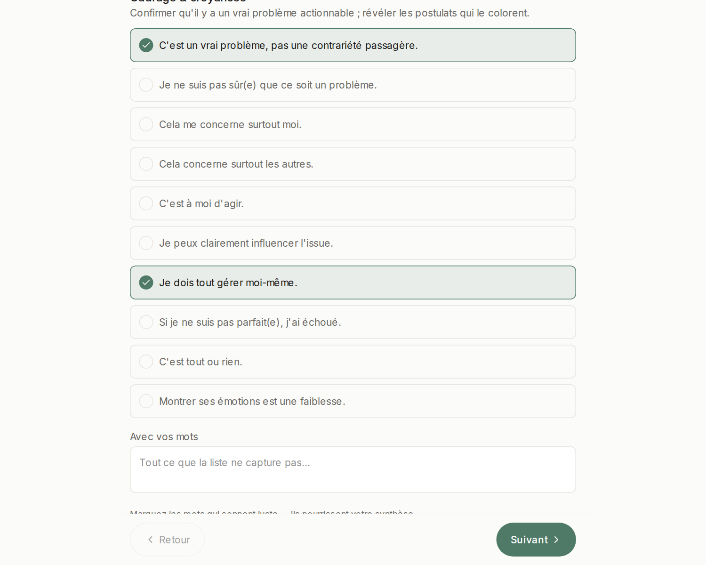
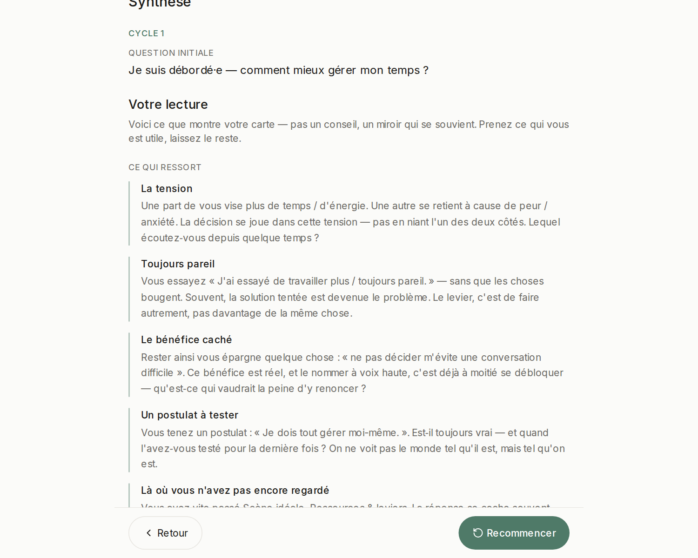

# Le parcours complet — de « je suis débordé·e » à un premier pas

> Fait partie du [guide d'utilisation](./README.md). Toutes les captures sont l'application réelle.

Voici l'exemple canonique de Q‑Art. Il ressemble à un problème de gestion du temps. Il n'en est pas un — et voir la méthode le découvrir est la meilleure façon de comprendre ce que fait Q‑Art.

## Le piège que Q‑Art interrompt

Quand une décision nous met mal à l'aise, l'esprit attrape le chemin tout fait le plus rapide du problème vers une réponse — un **schéma réflexe**. Très bien pour les problèmes routiniers. Sur un problème difficile, personnel, emmêlé, il saute en silence tout ce qui entoure la question… puis s'étonne que la « solution » ne tienne pas.

Le geste unique de Q‑Art : **travailler la question, pas la réponse.** Cartographier tout ce que le raccourci a sauté, et laisser la question elle-même se reformer. *« Un problème sans solution est un problème mal posé. »*

## Cycle 1 — cartographier la question

On ouvre **Atlas** et on pose la question telle qu'elle se présente aujourd'hui :

> *« Je suis débordé·e — comment mieux gérer mon temps ? »*

Le premier tableau demande si c'est vraiment un problème — et quelles **croyances** le colorent. Deux énoncés sonnent juste : on les coche. C'est tout ce que Q‑Art demande — ni notes, ni rédaction.

On continue de tableau en tableau — quelques coches honnêtes par facette :

- **Qui est concerné :** mon équipe, mes collègues.
- **Ce que j'éprouve :** peur / anxiété.
- **L'idéal & les bénéfices :** plus de temps et d'énergie.
- **Ce que j'ai déjà tenté :** travailler plus — toujours pareil.
- **Ce qui bloque :** *ne pas décider m'évite une conversation difficile.*

Dix minutes, peut-être moins. Aucune facette n'est obligatoire ; celles qu'on saute seront signalées, gentiment.

## La lecture — votre carte, interprétée

La synthèse ne vous relit pas vos réponses. Elle les **lit** :

Regardez ce que la carte fait remonter de six coches :

- **La tension** — une part de vous vise *plus de temps et d'énergie* ; une autre se retient à cause de la *peur*. La décision se joue dans cette tension.
- **Toujours pareil** — vous essayez *de travailler plus*, sans que rien ne bouge. Souvent, la solution tentée est devenue le problème.
- **Le bénéfice caché** — ne pas décider vous épargne *une conversation difficile*. Le nommer à voix haute, c'est déjà à moitié se débloquer.
- **Un postulat à tester** — *« je dois tout gérer moi-même »*. Est-il toujours vrai ? Quand l'avez-vous testé pour la dernière fois ?

Le problème de temps se dissout. Ce qui bloque vraiment : **la confiance et la délégation** — gardées par une croyance et une conversation qu'on évite.

## Le pivot — une meilleure question

Sous la lecture, Q‑Art propose des reformulations construites avec **vos propres mots**. Un clic en adopte une ; vous pouvez aussi écrire la vôtre.

> La question reformulée est toute la méthode. *« Poser la bonne question, c'est déjà tenir une bonne part de la réponse. »*

Quand elle sonne juste, prenez le pivot : **« Explorer cette question — nouveau cycle »**.

## Cycle 2 — de la question à l'action

La carte repart à neuf ; la question reformulée vous suit — et ce passage se termine autrement. Au second cycle, le **plan d'action** passe au premier plan : pour chaque pas, *quoi*, *avec qui*, *pour quand*, *comment savoir que ça a marché*, son statut (**prêt / à affiner / à construire**) — et *un auto-sabotage à surveiller*.

La posture est celle de la méthode : **le meilleur pas, pas le parfait** — petit, bientôt, à faible enjeu :

> *« Lundi, je confie la tâche ABC à X — en gardant seulement un œil léger. »*

## Ce qui vient de se passer

| Vous êtes arrivé·e avec | Vous repartez avec |
|---|---|
| « Comment mieux gérer mon temps ? » | « Comment apprendre à confier de vraies missions à mon équipe ? » |
| Un blocage flou et pesant | Le nœud, nommé — avec vos mots |
| Rien à en faire | Un premier petit pas, daté, avec son garde-fou |

Personne ne vous a conseillé·e. L'outil n'a jamais dit « déléguez davantage ». Il a rouvert les étapes que votre réflexe avait sautées — et c'est *vous* qui avez vu le chemin.

**Essayez avec la question que vous avez apportée.** Et à la fin d'un cycle, [exportez votre dossier](./vos-donnees.md) — votre carte, vos mots, votre fichier.
