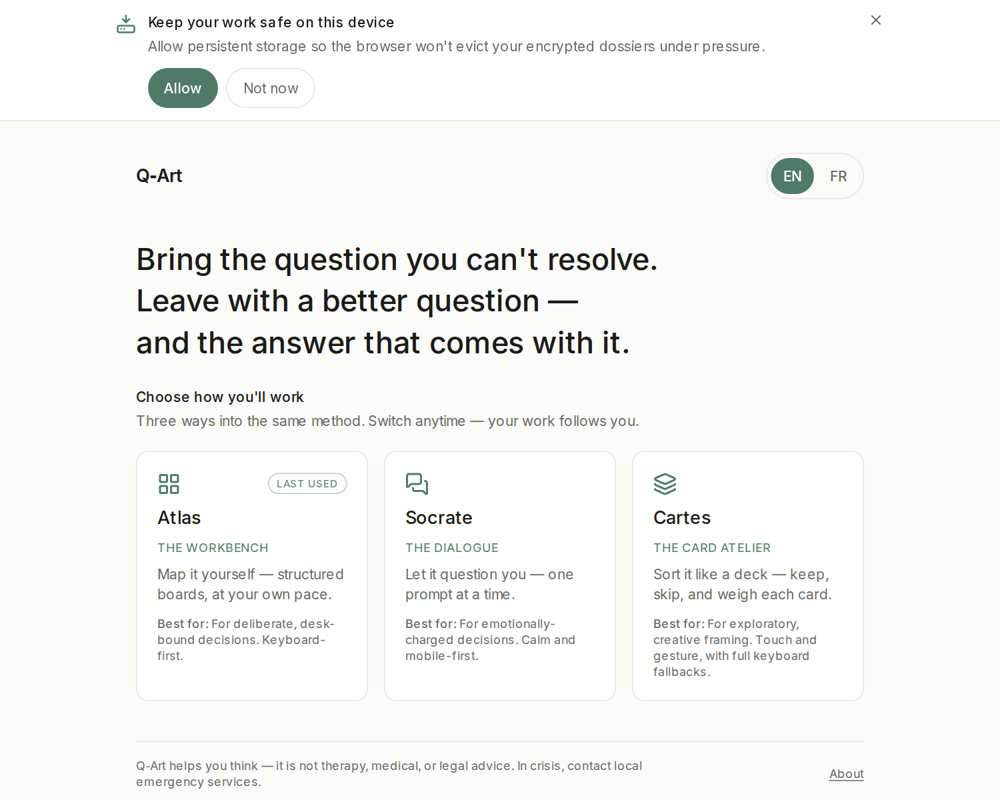

# Getting started — your first ten minutes

> Part of the [Q‑Art User Guide](./README.md).

## 1. Open Q‑Art

If someone set Q‑Art up for you, open the address they gave you (usually `http://localhost:3000`). To install it yourself on Debian/Ubuntu, one command:

```bash
curl -fsSL https://raw.githubusercontent.com/ideotion/q-art/main/install.sh | bash
```

then open `http://localhost:3000`. (Flags, uninstall, and what the script does: [`docs/install.md`](../install.md).)

Q‑Art runs entirely on your machine. Once loaded it also works offline.

## 2. Bring a real question

Q‑Art is built for the decision you keep circling — the one with no obvious right answer. Not "what should I have for lunch", but:

- *"Should I leave this job?"*
- *"Should I drop my most demanding client?"*
- *"How do I deal with my business partner?"*

State it as a question, in your own words. If several are tangled together, pick the one that weighs most **today** — the others will surface on their own.

## 3. Pick a way in



Three doors, one method — and they all write the **same** decision, so you can switch at any moment without losing a word:

- **Atlas** — structured boards you fill at your own pace. Pick this if you like seeing the whole map.
- **Socrate** — one calm question at a time. Pick this if the decision is emotionally charged and you'd rather be guided.
- **Cartes** — a deck of cards you keep or skip. Pick this if you don't know where to start.

(More on the differences: [Choosing your way in](./choosing-a-gui.md).)

## 4. Tick what rings true

Each facet of your question offers a short list of ready-made statements. **Ticking is enough** — there's no grade to give, no form to complete. Two or three honest ticks per facet already make a map. Anything the list doesn't capture goes in *"In your own words"*, and you can **retain** a word that matters so it feeds your synthesis.

Don't aim for complete. Aim for honest.

## 5. Read your synthesis

At the end, Q‑Art **reads your map back to you**: what keeps recurring, what pulls against what, the belief worth testing, the quiet payoff of not deciding. Then it offers **a better question** — and that's the whole point:

> You don't leave with a verdict. You leave with a reformulated question — and the answer usually lives inside it.

When a reframed question rings true, take the pivot: **"Explore this question — new cycle."** The map starts clean, the question carries over, and the second pass is where your **action plan** takes shape.

Your work saves automatically, encrypted, on this device. Close the tab whenever you like — the landing page will offer to continue where you left off.

**Next:** see the whole method on a worked example — [the full walkthrough](./walkthrough.md).
