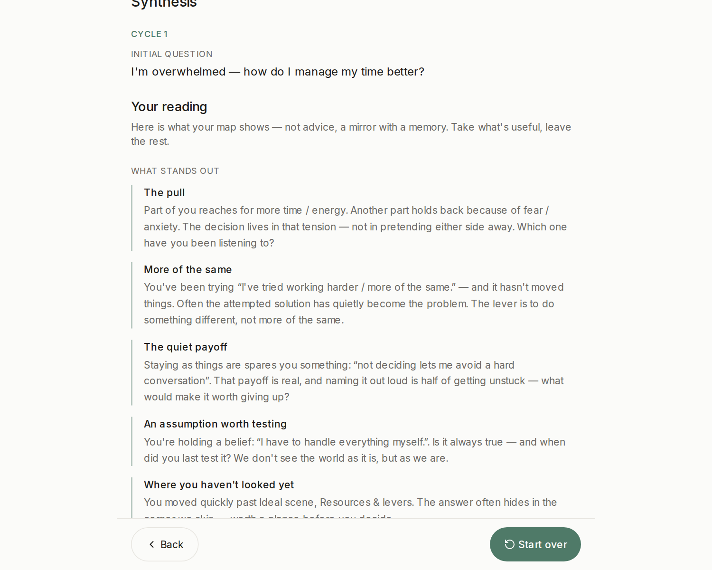
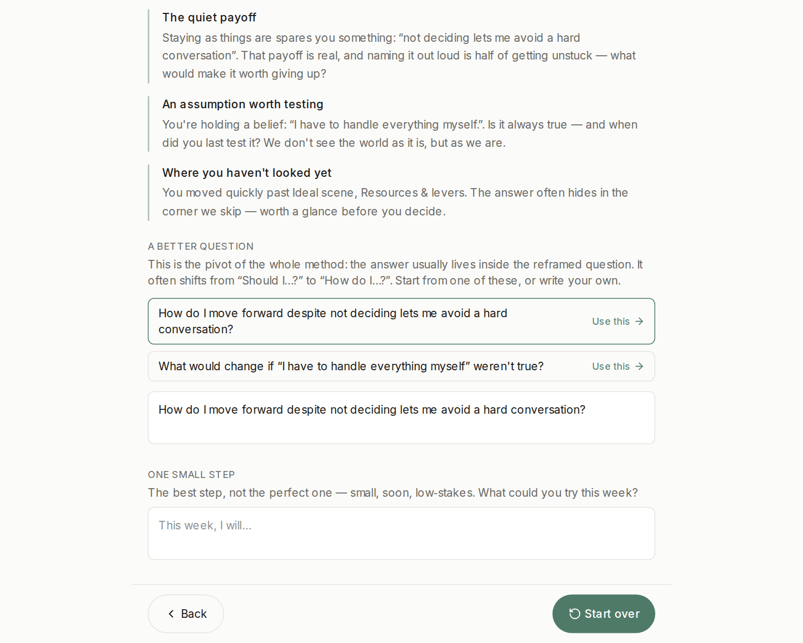
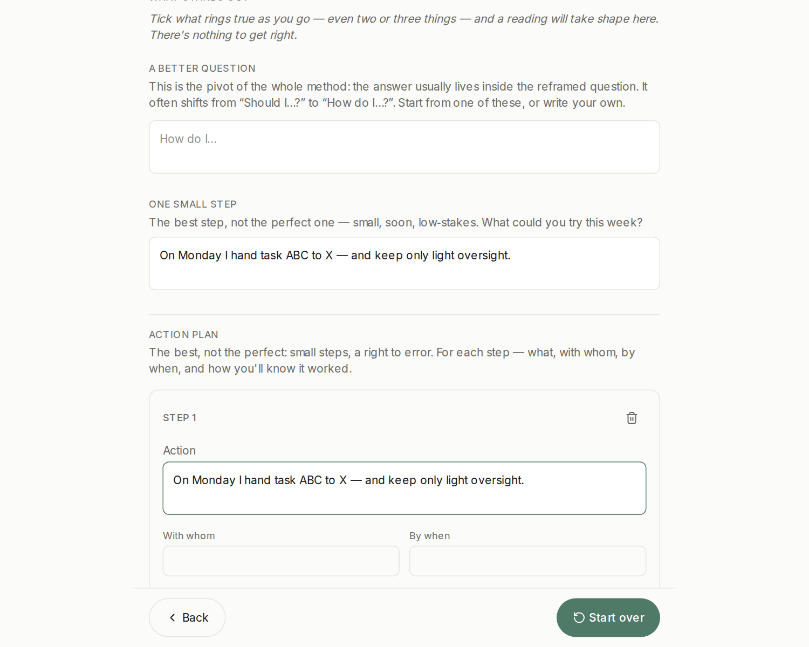

# A full walkthrough — from "I'm overwhelmed" to a first step

> Part of the [Q‑Art User Guide](./README.md). Every screenshot below is the real app.

This is Q‑Art's canonical example. It looks like a time-management problem. It isn't — and watching the method discover that is the best way to understand what Q‑Art does.

## The trap Q‑Art interrupts

When a decision makes us uncomfortable, the mind grabs the fastest ready-made route from problem to answer — a **reflex shortcut**. It works fine for routine problems. On a hard, personal, tangled one, it silently skips everything *around* the question… and then wonders why the "solution" doesn't hold.

Q‑Art's one move: **work on the question, not the answer.** Map everything the shortcut skipped, and let the question itself reform. *"A problem with no solution is a poorly-stated problem."*

## Cycle 1 — map the question

We open **Atlas** and state the question as it feels today:

> *"I'm overwhelmed — how do I manage my time better?"*

The first board asks whether this is really a problem — and which **beliefs** color it. Two statements ring true, so we tick them. That's all the input Q‑Art needs: no scores, no essays.

We keep walking the boards — a few honest ticks per facet:

- **Who's involved:** my team, my colleagues.
- **What I feel:** fear / anxiety.
- **The ideal & the benefits:** more time and energy.
- **What I've tried:** working harder — more of the same.
- **What's in the way:** *not deciding lets me avoid a hard conversation.*

Ten minutes, maybe less. No facet is mandatory; the ones we skip will be pointed out, gently.

## The reading — your map, interpreted

The synthesis doesn't list your answers back. It **reads** them:

Look at what the map surfaced from six ticks:

- **The pull** — part of you reaches for *more time and energy*; another part holds back out of *fear*. The decision lives in that tension.
- **More of the same** — you've been trying *working harder*, and it hasn't moved things. Often the attempted solution has quietly become the problem.
- **The quiet payoff** — not deciding spares you *a hard conversation*. Naming that out loud is half of getting unstuck.
- **An assumption worth testing** — *"I have to handle everything myself."* Is it always true? When did you last test it?

The time problem is dissolving. What's actually in the way is **trust and delegation** — guarded by a belief and a conversation being avoided.

## The pivot — a better question

Below the reading, Q‑Art offers reformulations built from **your own words**. One click adopts one; you can also write your own:

> The reformulated question is the whole method. *"Asking the right question is already holding a good part of the answer."*

When it rings true, take the pivot: **Explore this question — new cycle.**

## Cycle 2 — from question to action

The map starts clean; the reframed question carries over — and this pass ends differently. In a second cycle the **action plan** is front and centre: for each step, *what*, *with whom*, *by when*, *how you'll know it worked*, its status (**ready / to refine / still to build**) — and *a self-sabotage to watch*.

The guiding stance is the method's own: **the best step, not the perfect one** — small, soon, low-stakes:

> *"On Monday I hand task ABC to X — and keep only light oversight."*

## What just happened

| You arrived with | You leave with |
|---|---|
| "How do I manage my time better?" | "How do I learn to trust my team with real work?" |
| A vague, heavy stuckness | The knot, named — in your own words |
| Nothing to do about it | A first small step, dated, with a sabotage-watch |

Nobody advised you. The tool never said "delegate more." It re-opened the steps your reflex had skipped — and *you* saw the path.

**Try it with the question you brought.** And when you finish a cycle, [export your dossier](./your-data.md) — your map, your words, your file.
